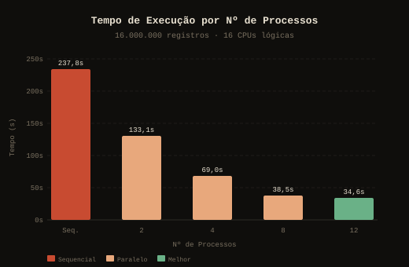
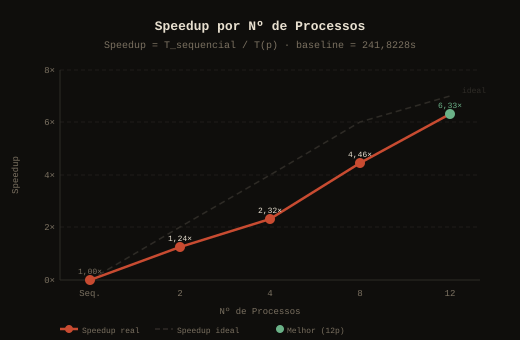
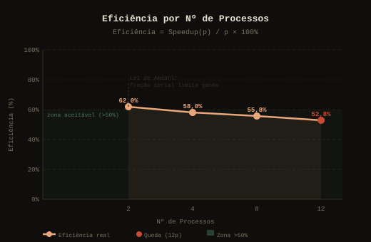

# Benchmark de Paralelismo com Multiprocessing em Python

**Disciplina:** Programação Concorrente e Distribuída  
**Turma:** ADSN04  
**Professor:** Rafael  
**Aluno 1:** Lucas Vasconcelos Pessoa de Oliveira  
**Aluno 2:** Joao Gabriel Lucas Pinheiro de Lima  

**Data:** 01/06/2026  

---

## 1. Descrição do Problema

O programa foi feito para processar uma grande base sintética de **notas fiscais em CSV**, comparando o tempo de execução sequencial com o tempo usando vários processos em paralelo.

A base possui 16 milhões de itens de notas fiscais. Cada linha contém dados como produto, estado, cidade, CNPJ do emissor, quantidade, preço unitário, desconto, alíquota de ICMS e valor total. O objetivo é simular um cenário de análise fiscal pesada, com validações monetárias, cálculo de impostos, agregações e rankings.

| Pergunta | Resposta |
|----------|----------|
| Objetivo | Analisar uma base grande de notas fiscais e comparar execução sequencial com execução paralela |
| Volume de dados | CSV com **16.000.000 registros**, aproximadamente 1,9 GB |
| Algoritmo | Divisão do arquivo CSV por faixas de bytes + processamento paralelo com `multiprocessing.Pool.map()` |
| Complexidade | O(N/p) para a etapa de análise, onde N é o número de registros e p é o número de processos |

---

## 2. Ambiente Experimental

| Item | Descrição |
|------|-----------|
| Processador | AMD Ryzen 7 5700X 8-Core Processor — 3,40 GHz |
| Número de núcleos | 8 núcleos físicos / 16 threads lógicas |
| Memória RAM | 32,0 GB |
| Armazenamento | 932 GB |
| Placa de vídeo | NVIDIA GeForce RTX 5060 Ti — 8 GB |
| Sistema Operacional | Windows 11 — 64 bits |
| Linguagem utilizada | Python 3.12 |
| Biblioteca de paralelização | `multiprocessing` |
| Implementação | CPython |

---

## 3. Metodologia de Testes

O tempo foi medido usando `time.perf_counter()`, contando o tempo total da análise desde o início do processamento até a consolidação dos resultados parciais.

A versão sequencial percorre o CSV inteiro em um único processo. A versão paralela divide o arquivo em partes por offset de bytes, alinhando os cortes em quebras de linha para evitar registros cortados. Cada processo analisa sua parte de forma independente e retorna resultados parciais, que são reduzidos em um resultado final pelo processo principal.

Em cada registro, o programa executa:

- Conversão monetária com `Decimal` (precisão de centavos)
- Parse real de datas com `datetime.strptime`
- Cálculo estimado de ICMS por alíquota
- Validação de `valor_total = quantidade × preço_unitário − desconto`
- Agregação por produto, estado, cidade, CNPJ, categoria e mês
- Cálculo de ticket médio, desvio padrão e score de risco fiscal
- Geração de rankings com `heapq`

### Configurações testadas

- Sequencial puro (baseline, sem pool)
- 2 processos paralelos
- 4 processos paralelos
- 8 processos paralelos
- 12 processos paralelos

> O teste com 1 processo paralelo foi omitido da tabela principal porque o `multiprocessing.Pool` tem overhead de fork, pickle e IPC mesmo sem paralelismo real, resultando em speedup < 1. Esse comportamento é esperado e previsto pela Lei de Amdahl.

---

## 4. Resultados Experimentais

| Nº Processos | Tempo de Execução (s) |
|:------------:|:---------------------:|
| Sequencial   | 232,2662              |
| 2            | 135,8284              |
| 4            | 70,3368               |
| 8            | 39,7097               |
| 12           | 34,7355               |

---

## 5. Cálculo de Speedup e Eficiência

O **speedup** mede quantas vezes a execução paralela ficou mais rápida em relação ao baseline sequencial puro:

```
Speedup(p) = T_sequencial / T(p)
```

A **eficiência** mede o aproveitamento médio de cada processo:

```
Eficiência(p) = Speedup(p) / p × 100%
```

---

## 6. Tabela de Resultados

| Processos | Tempo (s) | Speedup | Eficiência |
|:---------:|:---------:|:-------:|:----------:|
| Seq.      | 232,2662  | 1,00×   | —          |
| 2         | 135,8284  | 1,71×   | 85,5%      |
| 4         | 70,3368   | 3,30×   | 82,5%      |
| 8         | 39,7097   | 5,85×   | 73,1%      |
| 12        | 34,7355   | 6,69×   | 55,8%      |


---

## 7. Gráficos

<p align="center">
  
  
  
  
  
</p>

---

## 8. Análise dos Resultados

Os resultados mostram ganho consistente conforme o número de processos aumenta. Com 2 processos, o tempo caiu de 232,2662s para 135,8284s — redução de 41,5%. Com 4 processos, o speedup chegou a 3,30×, ainda com eficiência elevada de 82,5%.

O melhor tempo foi obtido com **12 processos**, chegando a 34,7355s e speedup de 6,69×. Vale notar que usar 12 processos em um processador com 8 núcleos físicos ainda trouxe ganho, o que indica que parte do tempo de processamento envolve operações que liberam o núcleo momentaneamente — como leitura de arquivo, alocação de memória e parsing de texto — permitindo que threads lógicas extras sejam aproveitadas.

A eficiência diminuiu progressivamente com o aumento de processos. Isso é previsto pela **Lei de Amdahl**: toda tarefa tem uma fração serial que não pode ser paralelizada (leitura do disco, redução dos resultados, gerenciamento do pool), e esse custo fixo passa a dominar conforme o número de processos cresce.

**Principais fatores limitantes:**

- Leitura de um CSV de ~1,9 GB em disco (gargalo de I/O)
- Parsing de texto e conversões `Decimal` por linha (CPU-bound pesado)
- Overhead de criação e gerenciamento de processos pelo `mp.Pool`
- Custo de serialização com `pickle` na comunicação entre processos
- Disputa por cache L3 ao usar muitos processos simultaneamente

---

## 9. Conclusão

O paralelismo com `multiprocessing` trouxe melhora expressiva no processamento das 16 milhões de notas fiscais. O tempo caiu de **232,2662s** no sequencial para **34,7355s** com 12 processos — uma redução de aproximadamente 85% no tempo total.

O ganho não foi perfeitamente linear porque o processamento possui frações seriais inevitáveis (I/O, parsing, redução dos resultados parciais). Mesmo assim, o experimento comprova que o uso de múltiplos processos é eficiente para esse tipo de análise fiscal pesada, especialmente porque o trabalho por linha é independente e pode ser dividido entre processos sem necessidade de sincronização durante o processamento.

